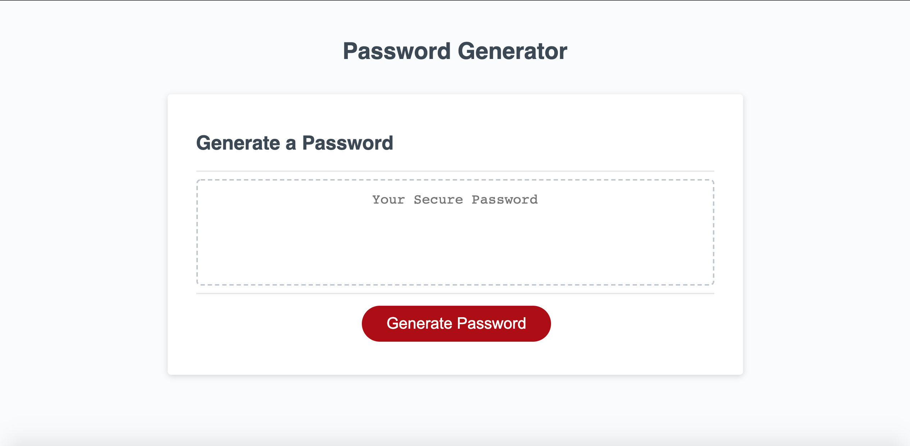

# Unique Password Generator

## Description
This is a password generator. When the user 
is prompted to select specific character types, ie uppercase, lowercase, numeric, and
special character, a randomly generated
password is returned to the user.

## Visuals

## Deployed Links

* [The URL of the deployed application.](https://simone188535.github.io/Unique-Password-Generator/)

* [The URL of the GitHub repository.](https://github.com/simone188535/Unique-Password-Generator)